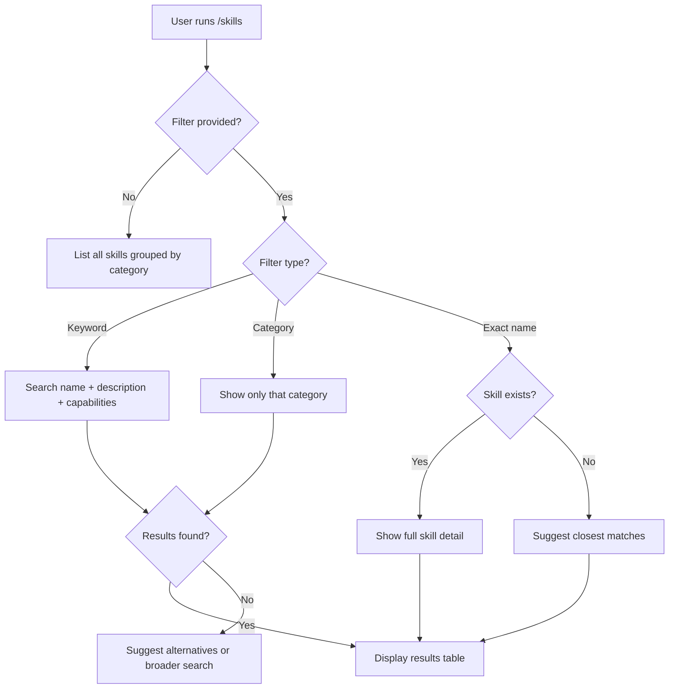
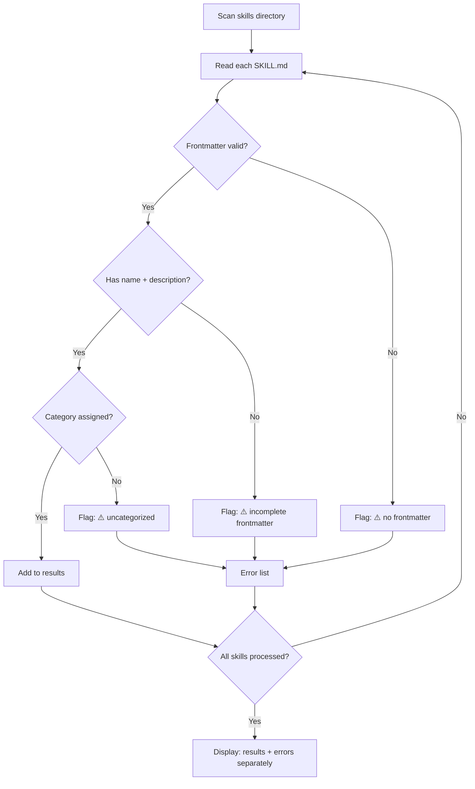

# 📋 Skills Command

List all available agent skills with their descriptions, use cases, and routing guidance.

## 🛑 The Iron Law

```
NO SKILL LISTING WITHOUT FRONTMATTER VALIDATION
```

Every skill listed must have valid frontmatter with at minimum: `name`, `description`, and `capabilities`. Skills with missing or malformed frontmatter are flagged, not silently skipped.

**No exceptions. No "probably fine" shortcuts. No listing without reading.**

Violating this law means: you show skills that may not exist, may be broken, or may mislead the user. A wrong listing is worse than no listing. This is non-negotiable — every listing is a promise of quality. No exceptions. Ever.

<HARD-GATE>
Before displaying skill results:
1. Each skill's SKILL.md has been read (not just directory listing)
2. Frontmatter has been parsed and validated (name + description present)
3. Skills with errors are flagged separately (not mixed into results)
4. If the skills directory is missing or empty → report the error, don't show an empty table.
</HARD-GATE>

<HARD-GATE>
Category mapping must be current:
1. Every skill in the directory appears in exactly one category
2. No orphan skills (uncategorized)
3. No ghost skills (listed but file missing)
4. Run validation: `bash scripts/validate-skill.sh skills/` before displaying
</HARD-GATE>

---

## 📐 Decision Tree: Filter Modes



## 📐 Decision Tree: Skill Validation Before Display



---

## Usage

```
/virtual-company:skills
/virtual-company:skills [filter]
/virtual-company:skills --category [category]
```

## Examples

**List all skills:**

```
/virtual-company:skills
```

**Filter by keyword:**

```
/virtual-company:skills testing
```

**Show skills by category:**

```
/virtual-company:skills --category architecture
```

**Search for specific domain:**

```
/virtual-company:skills data
```

---

## 📜 Implementation

### Step 1: Scan Skills Directory

```
1. Glob for all skills/*/SKILL.md
2. For each file, read the frontmatter (between --- delimiters)
3. Extract: name, description, capabilities, persona
4. Validate: name and description must be non-empty
5. Flag: files with missing or invalid frontmatter
```

### Step 2: Categorize

| Category           | Skills                                                                                       |
| ------------------ | -------------------------------------------------------------------------------------------- |
| **Orchestration**  | tech-lead, product-manager, workflow-orchestrator, skill-generator                           |
| **Logic**          | backend-architect, api-designer, data-engineer, ml-engineer                                  |
| **Frontend**       | frontend-architect, ux-designer, mobile-architect                                            |
| **Quality**        | bug-hunter, test-genius, security-reviewer, e2e-test-specialist                              |
| **Infrastructure** | infra-architect, docker-expert, k8s-orchestrator, ci-config-helper, observability-specialist |
| **Analysis**       | search-vector-architect, legacy-archaeologist, data-analyst                                  |
| **Maintenance**    | migration-upgrader, code-polisher, doc-writer                                                |
| **Meta**           | skill-generator                                                                              |

### Step 3: Format Output

**Full listing (no filter):**

```
# Virtual Company Skills — 27 Domain Experts

## Orchestration (4 skills)
| ID | Skill | Description | When to Use |
|----|-------|-------------|-------------|
| 00 | tech-lead | Complex implementation, coordination, and developer leadership | Full-stack features, multi-skill tasks |
| 21 | product-manager | Strategic product planning and prioritization | Feature scoping, roadmaps, PRDs |
| 24 | workflow-orchestrator | Multi-agent task dispatch and state management | Parallel/sequential agent coordination |
| 26 | skill-generator | Create new Virtual Company skills from scratch | Adding new domain experts |

## Quality (4 skills)
| ID | Skill | Description | When to Use |
|----|-------|-------------|-------------|
| 02 | bug-hunter | Systematic debugging and root cause analysis | Any bug, crash, test failure |
...
```

**Filtered listing:**

```
# Skills matching "test" (3 results)

| ID | Skill | Description | Category |
|----|-------|-------------|----------|
| 03 | test-genius | TDD-focused test generation and strategy | Quality |
| 22 | e2e-test-specialist | End-to-end browser testing with Playwright/Cypress | Quality |
| 02 | bug-hunter | Systematic debugging and root cause analysis | Quality |

Tip: Use /bug-hunter for "why is this test failing?"
     Use /test-genius for "write tests for this feature"
     Use /e2e-test-specialist for "test this user flow in a browser"
```

**Category view:**

```
# Architecture Skills (4 experts)

## api-designer
**Use when:** Designing REST/GraphQL APIs, defining contracts, writing OpenAPI specs
**Iron Law:** No implementation without contract first
**Key gate:** <HARD-GATE> API contract must be defined before implementation </HARD-GATE>

## backend-architect
**Use when:** Server logic, database queries, middleware, API handlers
**Iron Law:** No endpoint without a failing test first
...

Tip: For complex features spanning multiple architecture domains,
     use /tech-lead to coordinate.
```

**No results:**

```
No skills found matching "kubernetes".

Did you mean:
- /k8s-orchestrator — Kubernetes deployment and management
- /docker-expert — Container and Dockerfile optimization
- /infra-architect — Infrastructure as code (Terraform, Pulumi)

Use /skills to see all 27 available skills.
```

---

## 🚨 Failure Modes

| Situation                                        | Severity    | Response                                                                     |
| ------------------------------------------------ | ----------- | ---------------------------------------------------------------------------- |
| Skills directory missing or empty                | 🔴 Critical | Report: "No skills found. Check virtual-company installation."               |
| SKILL.md has no frontmatter                      | 🟡 Warning  | Flag: "⚠️ [skill-name] has no frontmatter — skipped"                         |
| SKILL.md has frontmatter but no name/description | 🟡 Warning  | Flag: "⚠️ [skill-name] has incomplete frontmatter"                           |
| Filter returns no results                        | 🟢 Info     | Suggest closest matches using fuzzy matching on names                        |
| Category doesn't exist                           | 🟡 Warning  | List valid categories and suggest the closest match                          |
| Skill file is unreadable                         | 🔴 Critical | Flag: "⚠️ [skill-name] could not be read — check permissions"                |
| Duplicate skill names across categories          | 🟡 Warning  | Flag: "⚠️ [skill-name] appears in multiple categories"                       |
| Frontmatter parse error (invalid YAML)           | 🔴 Critical | Flag: "❌ [skill-name] has malformed frontmatter — fix YAML syntax"          |
| Skill references non-existent script             | 🟡 Warning  | Flag: "⚠️ [skill-name] references missing script — check scripts/ directory" |
| Category mapping drift (new skill, no category)  | 🟡 Warning  | Auto-detect and flag: "⚠️ [skill-name] not in any category — update mapping" |

---

## 🚩 Red Flags / Anti-Patterns

❌ **Listing skills without actually reading their SKILL.md files**
→ You'll show deleted, broken, or renamed skills. Always READ, never GLOB-only.

❌ **Showing a skill that doesn't exist or has been deleted**
→ Ghost entries confuse users. Validate file existence before listing.

❌ **Returning "no results" without suggesting alternatives**
→ User typed a keyword that doesn't match? Suggest the closest 3 skills by name similarity.

❌ **Skipping frontmatter validation because "most skills are probably fine"**
→ This is how broken skills ship. Validate EVERY skill, EVERY time.

❌ **Mixing errored skills into the results table without flagging**
→ Errors must be in a separate section. Never hide failures in success output.

❌ **Hardcoding skill count instead of counting dynamically**
→ If you say "27 skills" but only 26 exist, you've lost trust. Count at runtime.

❌ **Ignoring category filter typos**
→ User typed `--category arcitecture`? Don't show nothing — suggest `architecture`.

❌ **Showing stale cached results instead of re-scanning**
→ Skills get added/modified. Always scan fresh, never serve stale data.

❌ **Truncating skill descriptions without indicating they were cut**
→ Show "..." if truncated. Never silently hide information.

**ALL of these mean: STOP. Validate before listing.**

---

## 🛠️ Tools & Scripts

Use these scripts to validate skill health before listing:

| Script                      | Purpose                                                         | Usage                                             |
| --------------------------- | --------------------------------------------------------------- | ------------------------------------------------- |
| `scripts/validate-skill.sh` | Validate SKILL.md quality (frontmatter, sections, placeholders) | `bash scripts/validate-skill.sh skills/`          |
| `scripts/tsv-log.sh`        | Log listing results as TSV for analytics                        | `bash scripts/tsv-log.sh /tmp/skills-listing.tsv` |

**Pre-flight check:** Before displaying skills, run:

```bash
bash scripts/validate-skill.sh skills/ 2>&1 | grep -c "FAIL"
```

If any FAIL, include them in the error section of the output.

---

## ✅ Verification Before Display

```
[x] Skills directory exists and is readable
[x] Each listed skill has valid frontmatter (name + description)
[x] Filter logic works: keyword search covers name + description + capabilities
[x] Category mapping is current (all 27 skills appear in exactly one category)
[x] No-result queries produce helpful suggestions
[x] Error skills displayed separately from valid results
[x] Script validation passed (validate-skill.sh)
[x] Dynamic skill count matches actual files
```

"No listing without validated skill data."

---

## 📋 Input/Output Contract

**Input:**

- No args → full listing grouped by category
- `[keyword]` → filtered by keyword in name/description/capabilities
- `--category [name]` → skills in that category only

**Output:**

- Formatted table with: ID, Skill Name, Description, Category/When-to-Use
- Error flags for invalid skills
- Suggestions for no-result queries
- Tip lines for related skills and routing guidance

---

## 🔗 Collaborative Links

| Skill                                                                   | Relationship            | When to Hand Off                                 |
| ----------------------------------------------------------------------- | ----------------------- | ------------------------------------------------ |
| [26-skill-generator](../skills/26-skill-generator/SKILL.md)             | Creates new skills      | When listing reveals a missing domain            |
| [00-tech-lead](../skills/00-tech-lead/SKILL.md)                         | Routes to correct skill | When user needs help choosing which skill to use |
| [24-workflow-orchestrator](../skills/24-workflow-orchestrator/SKILL.md) | Multi-skill dispatch    | When task spans multiple skill domains           |
| [04-code-polisher](../skills/04-code-polisher/SKILL.md)                 | Validates skill quality | When a skill's SKILL.md needs cleanup            |
